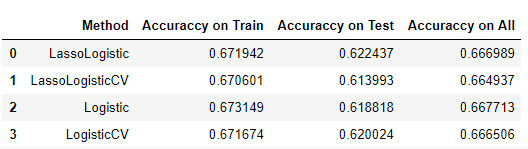
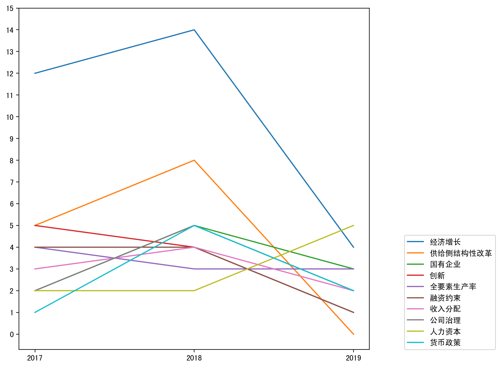
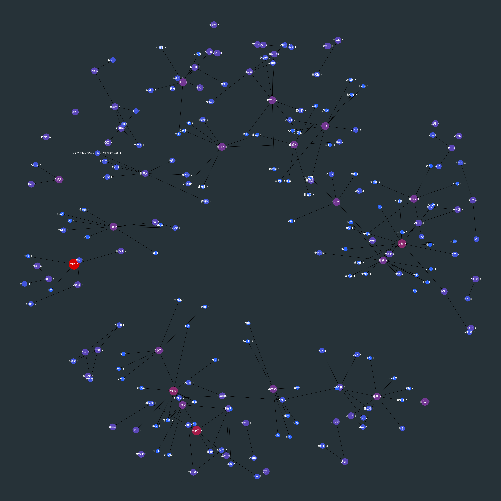

# 中山大学-计算社会科学讲座 第二组报告 （Python 版）

## 依赖

-   `Python (version > 3.5)`
-   `jupyter`
-   `sklearn`
-   `pandas`
-   `matplotlib`
-   `networkx`

### 依赖安装

1.  安装 Python 3
2.  安装相应包

```bash
pip install -U jupyter
pip install -U sklearn
pip install -U pandas
pip install -U matplotlib
pip install -U networkx
```

## Game 1

缺失值用上一值填充，分为 `30%` 的测试集和 `70%` 的训练集。

### 线性回归

运用线性回归 （`Lasso`，`LassoCV`，`Logistic`，`LogisticCV`） 方法，训练集上的正确率均为 `0.67` 左右，测试集上的正确率为 `0.62` 左右。



### 集成学习

运用 （`Random Forest`, `Gradient Boosting`, `Ada Boost`，`Bagging`, `KNeighbors`） 等方法，其中 `Random Forest` 和 `Bagging` 发生了严重的过拟合现象，训练集上正确率接近 `1.0`。

`Gradient Boosting` 表现最好，既没有发生严重的过拟合现象，在测试集上正确率也达到了 `66.5%`。


## Game 2

报告 `y ` 和 `x` 的正确回归系数

首先，利用 `Lasso`，`Lasso` + 交叉验证，`Ridge` （岭回归）对 `x1-11` 和 `y` 进行回归分析。

| Method    | $R^2$      | RMSE       | Lambda | Coefficient                           |
| --------- | ---------- | ---------- | ------ | ------------------------------------- |
| `Lasso`   | `0.993772` | `0.199946` | `0.1`  | `[1, 9, 10]`                          |
| `LassoCV` | `0.999769` | `0.038478` | `0.01` | `[1, 2, 4, 7, 8, 9, 10, 11]`          |
| `Ridge`   | `1.000000` | `0.000044` | `N/A`  | `[1, 2, 3, 4, 5, 6, 7, 8, 9, 10, 11]` |

可见，在选取三个变量 （`x1`，`x9`，`x10`）后，已经有较好的 $R^2$ 和均方误差。

我们针对各个各个变量分别进行回归分析，选取 $R^2 > 0.7$ 的认定他们有相关关系，绘图结果如下：


可见，其中许多变量都有较强的相关性，我们选取 `x1` 和 `x9` 应就可以达到较高的回归精度。

测试仅用 `x1` `x9` 回归，$R^2$ 已为 `0.9938137328426732` ，有较高的精度。

实际上，经过试验，发现仅使用 `x1` 进行回归，$R^2$ 也有 `0.990770885722794`，`RMSE` 变化不大，推测 `y` 实际上在数据生成时，仅与 `x1` 线性相关。

## Game 3

### 期刊主题有哪些？各年变迁情况？

统计了三年来最高频的 `20` 个关键词：


统计了三年来高频的 `10` 个关键词频次变化情况：



### 语义网络或人物网络分析？

摘取所有文献数之和大于 4 的合作作者，观察国内学者合作情况：



## 文件说明

两个大题的文件分别在 `./ML` 和 `./NLTK` 下。每个 `IPython` (`*.ipynb`) 文件均有对应的 `pdf` 版本

### 第一题

-   在训练数据上运行的结果（手动分出测试集） `./ML/p1.ipynb`
-   在测试集上运行的结果（训练集相同）`./ML/p1_valid.ipynb`

### 第二题

-   第二题的原始结果 `./ML/p2.ipynb`
-   第二题用工具变量的结果 `./ML/p2_iv.ipynb`

### 第三题

-   第一小题 `./NLTK/p3_1.ipynb`
-   第四小题 `./NLTK/p3_4.ipynb`

## 小组成员

-   **北京邮电大学 郑博文** 
-   **傅远志** 
-   **曾丽** 
-   **杨辉** 
-   **李梦林** 
-   **于锐** 
-   **莫能嘉**
