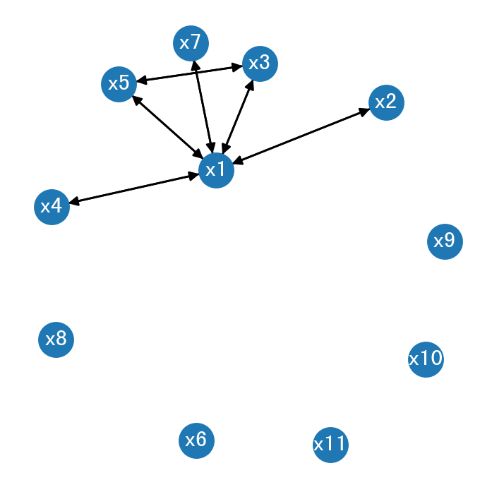

# 利用 Python 解决回归问题

## 导入数据


```python
import pandas as pd
import math
from IPython import display

df = pd.read_stata('game2_data.dta')

y = df['y']
x = df.drop(columns='y')

display.display(y.head())
display.display(x.head())
```


    0    2.438777
    1    0.629828
    2   -3.428959
    3   -1.320286
    4    1.773177
    Name: y, dtype: float32


<div>
<style scoped>
    .dataframe tbody tr th:only-of-type {
        vertical-align: middle;
    }

    .dataframe tbody tr th {
        vertical-align: top;
    }

    .dataframe thead th {
        text-align: right;
    }
</style>
<table border="1" class="dataframe">
  <thead>
    <tr style="text-align: right;">
      <th></th>
      <th>x1</th>
      <th>x2</th>
      <th>x3</th>
      <th>x4</th>
      <th>x5</th>
      <th>x6</th>
      <th>x7</th>
      <th>x8</th>
      <th>x9</th>
      <th>x10</th>
      <th>x11</th>
    </tr>
  </thead>
  <tbody>
    <tr>
      <th>0</th>
      <td>-9.163060</td>
      <td>-1.588530</td>
      <td>-0.802902</td>
      <td>-3.990557</td>
      <td>-0.802902</td>
      <td>1.584558</td>
      <td>-3.111471</td>
      <td>-0.451257</td>
      <td>2.154801</td>
      <td>-5.849712</td>
      <td>-1.384668</td>
    </tr>
    <tr>
      <th>1</th>
      <td>-1.438437</td>
      <td>1.177610</td>
      <td>-0.196004</td>
      <td>0.446565</td>
      <td>-0.196004</td>
      <td>-1.218185</td>
      <td>0.690861</td>
      <td>-2.143279</td>
      <td>0.121307</td>
      <td>-0.341499</td>
      <td>-0.467438</td>
    </tr>
    <tr>
      <th>2</th>
      <td>11.462125</td>
      <td>2.887286</td>
      <td>1.358113</td>
      <td>3.876879</td>
      <td>1.358113</td>
      <td>-0.815247</td>
      <td>2.638416</td>
      <td>0.158565</td>
      <td>-1.563668</td>
      <td>4.190841</td>
      <td>-0.548659</td>
    </tr>
    <tr>
      <th>3</th>
      <td>5.854400</td>
      <td>-0.552525</td>
      <td>1.233984</td>
      <td>1.719736</td>
      <td>1.233984</td>
      <td>2.150350</td>
      <td>0.896650</td>
      <td>-0.827780</td>
      <td>4.008009</td>
      <td>1.085393</td>
      <td>1.486160</td>
    </tr>
    <tr>
      <th>4</th>
      <td>-7.031788</td>
      <td>-1.952549</td>
      <td>-0.887858</td>
      <td>-2.296057</td>
      <td>-0.887858</td>
      <td>-0.705950</td>
      <td>0.054110</td>
      <td>-0.355626</td>
      <td>-2.779588</td>
      <td>-1.299902</td>
      <td>-0.291565</td>
    </tr>
  </tbody>
</table>
</div>


## Sklearn

### Lasso
- LassoCV
- Ridge


```python
import sklearn.linear_model as lm
from sklearn.metrics import mean_squared_error
from sklearn.model_selection import train_test_split

def get_vars(coef):
    return [i + 1 for i,x in enumerate(coef.tolist()) if abs(x) > 0]

x_train, x_test, y_train, y_test = train_test_split(x, y, test_size=0.1)

data = []

print("Lasso====================")

clf = lm.Lasso(alpha=0.09, copy_X=True, fit_intercept=True, max_iter=1000,normalize=False, positive=False, precompute=False, random_state=None,selection='cyclic', tol=0.0001, warm_start=False)
clf.fit(x_train, y_train)
print(clf.score(x, y))
print(clf.coef_)

y_predict = clf.predict(x_test)
rmse = mean_squared_error(y_test, y_predict) ** 0.5
print("rmse:%.10f" % rmse)

data.append(['Lasso', clf.score(x_test,y_test), rmse, 0.1, get_vars(clf.coef_)])

print("LassoCV====================")
clf = lm.LassoCV(alphas=[0.5, 0.2, 0.1, 0.09], cv=5)
clf.fit(x, y)
print(clf.score(x, y))
print(clf.coef_)
print("choose alpha=%.10f" % clf.alpha_)
y_predict = clf.predict(x_test)
rmse = mean_squared_error(y_test, y_predict) ** 0.5
print("rmse:%.10f" % rmse)

data.append(['LassoCV', clf.score(x_test,y_test), rmse, clf.alpha_, get_vars(clf.coef_)])

print("Ridge====================")
clf = lm.Ridge(alpha=0.1)
clf.fit(x_train, y_train)
print(clf.score(x_test, y_test))
print(clf.coef_)
y_predict = clf.predict(x_test)
rmse = mean_squared_error(y_test, y_predict) ** 0.5
print("rmse:%.10f" % rmse)

data.append(['Ridge', clf.score(x_test,y_test), rmse, "", get_vars(clf.coef_)])

pd.DataFrame(data, columns=['Method', 'R^2', 'RMSE', 'Lambda', 'Coefficient'])
```

    Lasso====================
    0.9946700501294943
    [-0.30531312  0.          0.          0.          0.          0.
     -0.         -0.00411733  0.04722745  0.01897528  0.00989574]
    rmse:0.1847789031
    LassoCV====================
    0.9946772347480978
    [-0.30537354  0.          0.          0.          0.          0.
     -0.         -0.0046635   0.04744116  0.01919822  0.00910188]
    choose alpha=0.0900000000
    rmse:0.1845967626
    Ridge====================
    0.9999999999963733
    [-2.99999170e-01  3.32191089e-07 -7.33043954e-06  3.83274008e-07
     -7.33044120e-06 -9.99871236e-02 -9.99983999e-02 -9.99997006e-02
      9.99966680e-02  1.00000064e-01  9.99989065e-02]
    rmse:0.0000047801


<div>
<style scoped>
    .dataframe tbody tr th:only-of-type {
        vertical-align: middle;
    }

    .dataframe tbody tr th {
        vertical-align: top;
    }

    .dataframe thead th {
        text-align: right;
    }
</style>
<table border="1" class="dataframe">
  <thead>
    <tr style="text-align: right;">
      <th></th>
      <th>Method</th>
      <th>R^2</th>
      <th>RMSE</th>
      <th>Lambda</th>
      <th>Coefficient</th>
    </tr>
  </thead>
  <tbody>
    <tr>
      <th>0</th>
      <td>Lasso</td>
      <td>0.994581</td>
      <td>0.184779</td>
      <td>0.1</td>
      <td>[1, 8, 9, 10, 11]</td>
    </tr>
    <tr>
      <th>1</th>
      <td>LassoCV</td>
      <td>0.994592</td>
      <td>0.184597</td>
      <td>0.09</td>
      <td>[1, 8, 9, 10, 11]</td>
    </tr>
    <tr>
      <th>2</th>
      <td>Ridge</td>
      <td>1.000000</td>
      <td>0.000005</td>
      <td></td>
      <td>[1, 2, 3, 4, 5, 6, 7, 8, 9, 10, 11]</td>
    </tr>
  </tbody>
</table>
</div>


## NetworkX 绘制变量间相关性图片


```python
from matplotlib import pyplot as plt
import matplotlib as mpl

plt.rcParams['font.family']='sans-serif' 
plt.rcParams['font.sans-serif']=['SimHei'] #用来正常显示中文标签
plt.rcParams['axes.unicode_minus']=False #用来正常显示负号

import networkx as nx
dpi = 200
size = 640
fig = plt.figure(figsize=(size/dpi, size/dpi), dpi=dpi)


G = nx.DiGraph()

for i in range(1, 12):
    G.add_node('x' + str(i))

for i in range(1, 12):
    for j in range(1, 12):
        if(i != j):
            clf = lm.LinearRegression()
            xt = x['x' + str(i)].to_numpy().reshape(-1, 1)
            yt = x['x' + str(j)]
            clf.fit(xt, yt)
            score = clf.score(xt, yt)
            if(score > 0.8):
                G.add_edge('x' + str(i), 'x' + str(j))

pos = nx.spring_layout(G,k=1.5,scale=3)
nx.draw(G, pos, font_color='w', with_labels=True)
plt.show()
```

    /usr/local/lib/python3.6/dist-packages/networkx/drawing/nx_pylab.py:579: MatplotlibDeprecationWarning: 
    The iterable function was deprecated in Matplotlib 3.1 and will be removed in 3.3. Use np.iterable instead.
      if not cb.iterable(width):
    /usr/local/lib/python3.6/dist-packages/networkx/drawing/nx_pylab.py:676: MatplotlibDeprecationWarning: 
    The iterable function was deprecated in Matplotlib 3.1 and will be removed in 3.3. Use np.iterable instead.
      if cb.iterable(node_size):  # many node sizes





## 仅利用 `x1` 进行线性回归


```python
clf = lm.LinearRegression()
xt = x_train[['x1']]
yt = y_train


clf.fit(x[['x1']],  y)
score = clf.score(xt, yt)
print(score)
print(clf.coef_)
y_predict = clf.predict(x_test[['x1']])
rmse = mean_squared_error(y_test, y_predict) ** 0.5
print("rmse:%.10f" % rmse)
```

    0.9907975868718224
    [-0.2978162]
    rmse:0.2446448955

