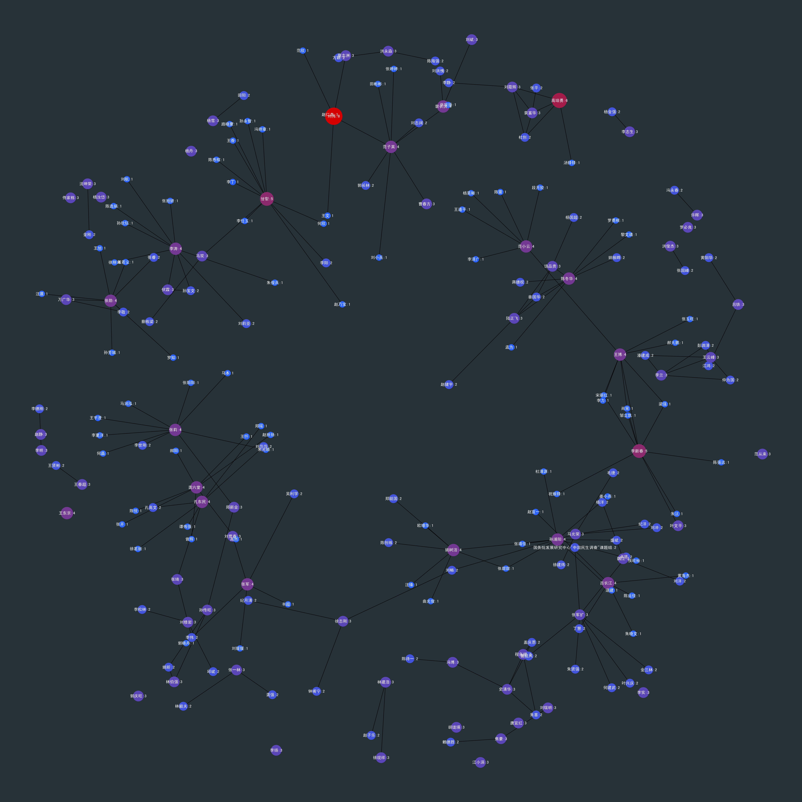

```python
import os
print(os.getcwd())

import pandas as pd

df = pd.read_stata('text_example_final.dta')

journal1 = df[df['source']==u'管理世界']
journal2 = df[df['source']==u'经济研究']
```

    /mnt/c/OneDrive/computational-sociology/NLTK


```python
journal1.head()
```


<div>
<style scoped>
    .dataframe tbody tr th:only-of-type {
        vertical-align: middle;
    }

    .dataframe tbody tr th {
        vertical-align: top;
    }

    .dataframe thead th {
        text-align: right;
    }
</style>
<table border="1" class="dataframe">
  <thead>
    <tr style="text-align: right;">
      <th></th>
      <th>title</th>
      <th>author</th>
      <th>organ</th>
      <th>source</th>
      <th>keyword</th>
      <th>summary</th>
      <th>fund</th>
      <th>year</th>
      <th>id</th>
    </tr>
  </thead>
  <tbody>
    <tr>
      <th>500</th>
      <td>高质量发展的目标要求和战略路径</td>
      <td>张军扩;侯永志;刘培林;何建武;卓贤;</td>
      <td>国务院发展研究中心;国务院发展研究中心发展战略和区域经济研究部;</td>
      <td>管理世界</td>
      <td>高质量发展;;目标要求;;战略路径</td>
      <td>我国经济已由高速增长阶段转向高质量发展阶段,推动高质量发展,关乎全面建成小康社会,关乎基本实...</td>
      <td></td>
      <td>NaN</td>
      <td>501.0</td>
    </tr>
    <tr>
      <th>501</th>
      <td>政府空气污染治理效应评估——来自中国“低碳城市”建设的经验研究</td>
      <td>宋弘;孙雅洁;陈登科;</td>
      <td>复旦大学经济学院;上海市国际金融与经济研究院;新加坡国立大学房地产系;</td>
      <td>管理世界</td>
      <td>低碳城市;;空气污染;;污染防治;;双重差分;;绿色发展</td>
      <td>党的十九大报告明确将污染防治列为决胜全面建成小康社会的三大攻坚战之一。在此背景下,本文以"低...</td>
      <td>国家自然科学基金青年项目(项目号:71803027);; 教育部人文社会科学青年基金项目(项...</td>
      <td>2019.0</td>
      <td>502.0</td>
    </tr>
    <tr>
      <th>502</th>
      <td>空气质量改善能降低企业劳动力成本吗?</td>
      <td>沈永建;于双丽;蒋德权;</td>
      <td>南京财经大学;苏州大学;上海财经大学会计与财务研究院;</td>
      <td>管理世界</td>
      <td>空气质量;;劳动力成本;;职工激励;;非货币性收益</td>
      <td>空气质量是职工的一项重要非货币性收益,与货币薪酬可能形成替代。本文以2005～2015年我国...</td>
      <td>国家自然科学基金面上项目“基于职工利益保护的政府管制、劳动力成本与微观企业产业升级研究”(批...</td>
      <td>2019.0</td>
      <td>503.0</td>
    </tr>
    <tr>
      <th>503</th>
      <td>女性创业者合法性的构建与重塑过程研究</td>
      <td>李纪珍;周江华;谷海洁;</td>
      <td>清华大学技术创新研究中心;清华大学经济管理学院;北京师范大学经济与工商管理学院;中国民族证券...</td>
      <td>管理世界</td>
      <td>女性创业者;;合法性;;合法性构建;;合法性困境;;合法性重塑</td>
      <td>女性创业者合法性对于女性创业者取得创业所需的关键资源和市场接受度至关重要。本文通过对6位女性...</td>
      <td>国家自然科学基金项目(71772103、71772014);; 高校人文社会科学重点研究基地...</td>
      <td>2019.0</td>
      <td>504.0</td>
    </tr>
    <tr>
      <th>504</th>
      <td>贸易自由化如何影响中国区域劳动力市场?</td>
      <td>戴觅;张轶凡;黄炜;</td>
      <td>北京师范大学经济与工商管理学院;香港中文大学经济系;江西财经大学产业经济研究院;新加坡国立大...</td>
      <td>管理世界</td>
      <td>贸易自由化;;关税削减;;工资;;技能溢价;;收入分配</td>
      <td>本文采用2002～2007年城镇住户调查(UHS)微观数据,研究中国加入WTO后的进口关税削...</td>
      <td>国家社会科学基金重大项目(项目号:14ZDA082)、国家自然科学基金青年项目(项目号:71...</td>
      <td>2019.0</td>
      <td>505.0</td>
    </tr>
  </tbody>
</table>
</div>


```python
journal2.head()
```


<div>
<style scoped>
    .dataframe tbody tr th:only-of-type {
        vertical-align: middle;
    }

    .dataframe tbody tr th {
        vertical-align: top;
    }

    .dataframe thead th {
        text-align: right;
    }
</style>
<table border="1" class="dataframe">
  <thead>
    <tr style="text-align: right;">
      <th></th>
      <th>title</th>
      <th>author</th>
      <th>organ</th>
      <th>source</th>
      <th>keyword</th>
      <th>summary</th>
      <th>fund</th>
      <th>year</th>
      <th>id</th>
    </tr>
  </thead>
  <tbody>
    <tr>
      <th>0</th>
      <td>2019中国信息经济学乌家培奖评选公告</td>
      <td></td>
      <td>中国信息经济学会;</td>
      <td>经济研究</td>
      <td></td>
      <td>为促进中国信息经济与信息管理领域的青年学者产生影响未来30年世界理论发展的创新成果,中国信息...</td>
      <td></td>
      <td>2019.0</td>
      <td>1.0</td>
    </tr>
    <tr>
      <th>1</th>
      <td>债务高企、风险集聚与体制变革——对发展型政府的反思与超越</td>
      <td>张晓晶;刘学良;王佳;</td>
      <td>中国社会科学院经济研究所中国宏观经济稳定课题组;</td>
      <td>经济研究</td>
      <td>宏观杠杆率;;债务风险;;发展型政府;;体制变革</td>
      <td>本文通过分析中国债务的形成机制,指出体制性因素是债务高企的根本原因。这一体制性因素可概括为国...</td>
      <td></td>
      <td>2019.0</td>
      <td>2.0</td>
    </tr>
    <tr>
      <th>2</th>
      <td>自然利率与中国宏观政策选择</td>
      <td>徐忠;贾彦东;</td>
      <td>中国人民银行;</td>
      <td>经济研究</td>
      <td>自然利率;;潜在产出;;全要素生产率;;宏观政策</td>
      <td>本文讨论的核心是如何准确认识和理解自然利率,并尝试建立以自然利率为基础的宏观经济分析和政策决...</td>
      <td></td>
      <td>2019.0</td>
      <td>3.0</td>
    </tr>
    <tr>
      <th>3</th>
      <td>中国国有企业的独特作用:基于知识溢出的视角</td>
      <td>叶静怡;林佳;张鹏飞;曹思未;</td>
      <td>北京大学经济学院;中欧国际工商学院;北京师范大学经济与管理学院;</td>
      <td>经济研究</td>
      <td>知识溢出;;基础研究;;市场失灵;;国有企业</td>
      <td>国有企业是政府解决市场失灵的工具。本文从知识溢出角度研究中国国有企业的作用。基于上市企业样本...</td>
      <td></td>
      <td>2019.0</td>
      <td>4.0</td>
    </tr>
    <tr>
      <th>4</th>
      <td>国有资本划转养老保险基金与劳动力长期供给</td>
      <td>景鹏;郑伟;</td>
      <td>西南财经大学保险学院;北京大学经济学院;</td>
      <td>经济研究</td>
      <td>国有资本;;养老保险;;划转率;;劳动力供给</td>
      <td>国有资本划转养老保险基金通过“挤占公共财政收入”和“放松个人预算约束”两条路径影响劳动力供给...</td>
      <td></td>
      <td>2019.0</td>
      <td>5.0</td>
    </tr>
  </tbody>
</table>
</div>


```python
nodes = {
    
}

for row in df.iterrows():
    authors = row[1]['author']
    authors = authors.split(';')
    for author in authors:
        if author == "":
            break
        if(author not in nodes):
            nodes[author] = 0
        nodes[author] = nodes[author] + 1
        
node_list = []
for author in nodes.keys():
    node_list.append((nodes[author], author))

node_list = sorted(node_list)
node_list.reverse()
    
print(node_list[0:100])

```

    [(8, '刘伟'), (6, '高培勇'), (5, '甘犁'), (5, '李新春'), (4, '龚六堂'), (4, '陈冬华'), (4, '裴长洪'), (4, '范小云'), (4, '范子英'), (4, '王博'), (4, '王东京'), (4, '李涛'), (4, '张莉'), (4, '张勋'), (4, '张军'), (4, '孙浦阳'), (4, '孔东民'), (4, '姚树洁'), (4, '吕长江'), (3, '魏江'), (3, '马双'), (3, '马光荣'), (3, '饶品贵'), (3, '陆正飞'), (3, '郭庆旺'), (3, '郑新业'), (3, '赵静'), (3, '许晖'), (3, '袁富华'), (3, '蔡志洲'), (3, '范从来'), (3, '胡珑瑛'), (3, '罗必良'), (3, '程名望'), (3, '王春超'), (3, '王云峰'), (3, '焦豪'), (3, '洪永淼'), (3, '洪俊杰'), (3, '沈坤荣'), (3, '江小涓'), (3, '林建浩'), (3, '林伯强'), (3, '杨雪'), (3, '杨汝岱'), (3, '杨丹'), (3, '李明'), (3, '李扬'), (3, '李志生'), (3, '李实'), (3, '李兰'), (3, '曹春方'), (3, '徐现祥'), (3, '徐志刚'), (3, '张琦'), (3, '张军扩'), (3, '张一林'), (3, '孙传旺'), (3, '唐宜红'), (3, '吕铁'), (3, '叶文平'), (3, '史清华'), (3, '刘霞辉'), (3, '刘贯春'), (3, '刘瑞明'), (3, '刘斌'), (3, '刘修岩'), (3, '冯博'), (3, '佟家栋'), (3, '伏霖'), (3, '万广华'), (2, '龚强'), (2, '黄阳华'), (2, '黄薇'), (2, '黄益平'), (2, '黄玖立'), (2, '黄宗晔'), (2, '鲁晓东'), (2, '马草原'), (2, '马新啸'), (2, '马文涛'), (2, '马慧'), (2, '马建堂'), (2, '颜色'), (2, '韩言虎'), (2, '韩剑'), (2, '韩保江'), (2, '韩俊'), (2, '鞠晓生'), (2, '陈逢文'), (2, '陈运森'), (2, '陈诗一'), (2, '陈胜蓝'), (2, '陈登科'), (2, '陈海强'), (2, '陈林'), (2, '陈彦斌'), (2, '陈小亮'), (2, '陈创练'), (2, '陈信元')]


```python
from matplotlib import pyplot as plt
import matplotlib as mpl

plt.rcParams['font.family']='sans-serif' 
plt.rcParams['font.sans-serif']=['SimHei'] #用来正常显示中文标签
plt.rcParams['axes.unicode_minus']=False #用来正常显示负号


import networkx as nx
G = nx.Graph()
for row in df.iterrows():
    authors = row[1]['author']
    authors = authors.split(';')
    for u in authors:
        for v in authors:
            if u == "" or v == "":
                break
            if nodes[u] + nodes[v] > 4: 
                #print("n:" + u + v)
                G.add_edge("%s:%d" % (u, nodes[u]), "%s:%d" % (v, nodes[v]))

dpi = 200
size = 6400
fig = plt.figure(figsize=(size/dpi, size/dpi), dpi=dpi)

pos = nx.spring_layout(G,k=0.2,iterations=50, scale=1)
colors = [nodes[n.split(':')[0]] for n in G.nodes()]
cmap = mpl.colors.LinearSegmentedColormap.from_list('cmap', ['#2962FF', '#D50000'], 256)
sizes = [nodes[n.split(':')[0]] * 300 for n in G.nodes()]
nx.draw(G, pos, font_color='w', node_size=sizes, with_labels=True, node_color=colors, cmap=cmap)
fig.set_facecolor("#263238")


plt.savefig('p1.png')
```




